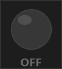

# ime-pilot-lamp-indicator

A lightweight Windows desktop application that shows the current **IME (Input Method Editor) state** — **ON** or **OFF** — as a glowing pilot-lamp indicator.

## Features

- **Always-on-top** borderless mini-window positioned in the top-right corner of your screen by default
- **Green glowing lamp** when IME is ON (e.g. Japanese/Chinese/Korean input active)
- **Dim gray lamp** when IME is OFF (Latin / direct input)
- **System tray icon** that also reflects the current state; double-click to show/hide the indicator window
- **Draggable** — left-click and drag the window anywhere on screen
- **Polls every 100 ms** using the Windows IME API (`ImmGetDefaultIMEWnd` + `WM_IME_CONTROL / IMC_GETOPENSTATUS`) to stay in sync with whichever window has focus

## Screenshots

| IME OFF | IME ON |
|---------|--------|
|  |  |

## Requirements

- Windows 10 / 11 (64-bit)
- [.NET 8 Desktop Runtime](https://dotnet.microsoft.com/en-us/download/dotnet/8.0) (or newer)

## Build

```bash
cd ImePilotLamp
dotnet build -c Release
```

The compiled executable is placed in `ImePilotLamp/bin/Release/net8.0-windows/`.

## Publish (single-file, self-contained)

```bash
cd ImePilotLamp
dotnet publish -c Release -r win-x64 --self-contained true -p:PublishSingleFile=true
```

## Usage

Run `ImePilotLamp.exe`. The pilot lamp appears in the top-right corner of your screen.

| Action | Result |
|--------|--------|
| Left-click and drag | Move the indicator window |
| Right-click (window or tray icon) | Open context menu (Show/Hide, Exit) |
| Double-click tray icon | Toggle window visibility |

## How it works

1. A `System.Windows.Forms.Timer` fires every 100 ms.
2. The current foreground window handle is obtained via `GetForegroundWindow()`.
3. The IME window for that handle is resolved with `ImmGetDefaultIMEWnd()`.
4. A `WM_IME_CONTROL / IMC_GETOPENSTATUS` message is sent to the IME window.
5. A non-zero return value means IME is open (ON); zero means closed (OFF).
6. The indicator repaints only when the state actually changes.

## Project structure

```
ImePilotLamp/
  ImePilotLamp.csproj   – WinForms project (net8.0-windows)
  Program.cs            – Application entry point
  MainForm.cs           – Pilot lamp UI and IME polling logic
  MainForm.Designer.cs  – Designer-generated form setup
  NativeMethods.cs      – P/Invoke declarations (imm32.dll, user32.dll)
```
